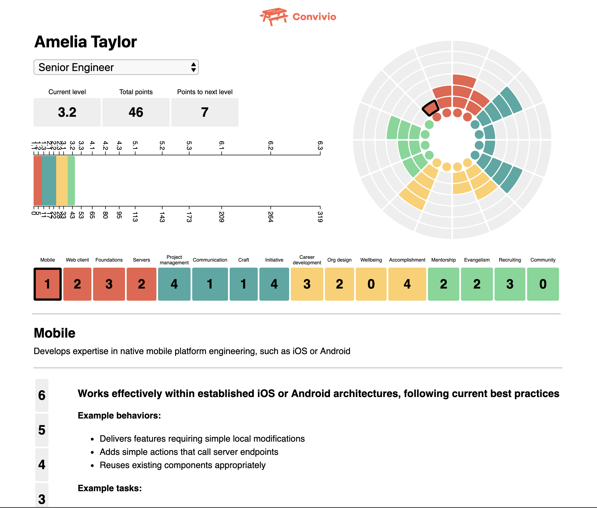

# Convivio Professional Development

This is our tool for planning and supporting our engineers' career development. It's based on Medium's [Snowflake](https://github.com/Medium/snowflake) tool.

## Installation

Get yarn if you don’t have it already:

`npm install -g yarn`

Install dependencies:

`yarn`

### Running the dev server

`yarn dev`

### Building

`yarn export`

This will put a static version of the site in `out/`.
